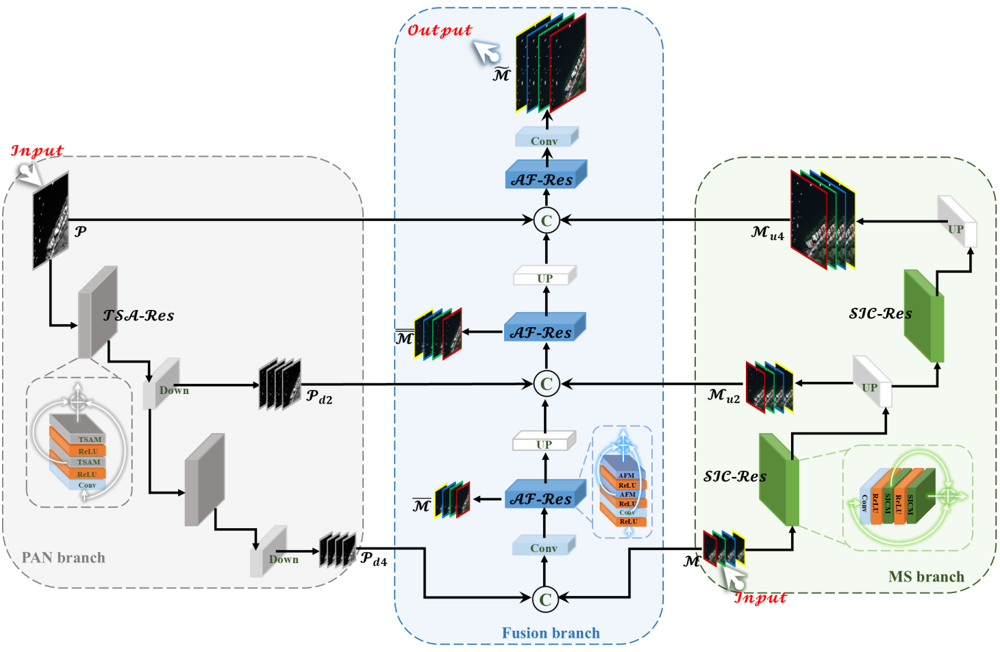
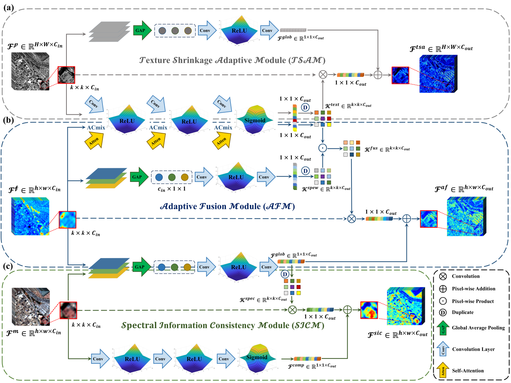
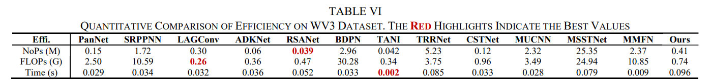
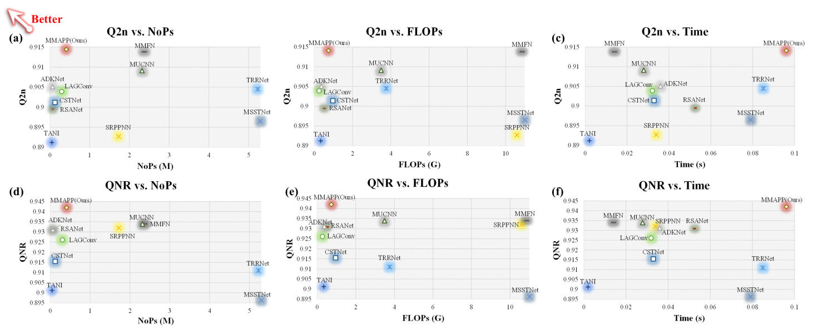

<div align="center">


# MMAPP
**Multi-branch and Multi-scale Adaptive Progressive Pyramid Network for Multispectral Image Pansharpening.**

______________________________________________________________________

<p align="center">
<a href="https://ieeexplore.ieee.org/document/10741347">Paper</a> •
<a href="#Abstract">Abstract</a> •
<a href="#Method">Method</a> •
<a href="#Dependencies">Installation</a> •
<a href="#Dataset">Dataset</a> •
<a href="#Training">Training</a> •
<a href="#Testing">Testing</a> •
<a href="#Pre-trained-models-and-results">Weights</a> •
<a href="#Citation">Citation</a><br>
</p>

[]()

</div>

______________________________________________________________________
### What's New
- **[November 7th, 2024]**: Our other work, [CF2N](https://github.com/JUSTM0VE0N/CF2N), is published: [A novel cross fusion model with ffne-grained detail reconstruction for remote sensing image pan-sharpening](https://www.tandfonline.com/doi/full/10.1080/10095020.2024.2416899).
- **[November 4th, 2024]**: The code of MMAPP is available.
- **[November 1st, 2024]**: After 500 days, the paper of MMAPP is published: [MMAPP: Multi-branch and Multi-scale Adaptive Progressive Pyramid Network for Multispectral Image Pansharpening](https://ieeexplore.ieee.org/document/10741347).
- **[June 21th, 2023]**: MMAPP is first submission!!!


### Abstract
Pansharpening is the process of integrating two heterogeneous re-mote sensing images to obtain high-resolution multispectral images, which is crucial for downstream tasks. Existing methods utilizing advanced deep learning techniques are able to achieve good sharpening results. However, the heterogeneity between diverse source images is not sufficiently considered, which in turn results in distortions in the sharpening results. Addressing this gap, we have developed a multi-branch pyramid structure, which can build bridges between diverse source images at various scales. It contains three distinct branches, including the PAN branch, the MS branch and the Fusion branch, which efficiently and seamlessly integrates the data flow in distinct branches by means of the pyramid structure. Furthermore, in order to retain more advantageous information, we have developed a specialized adaptive extraction and integration module (AEIM) for each branch, namely, the texture shrinkage adaptive module for the PAN branch, the spectral information consistency module for the MS branch, and the adaptive fusion module for the Fusion branch. These AEIMs are specifically designed to cater to diverse sources and distinct stages of the pansharpening process. The adaptive weights they generate can be used to extract and fuse more advantageous information. Ultimately, high-fidelity sharpening outcomes are obtained by minimizing the reconstruction errors at various scales in distinct branches. Extensive experiments show that our methodology surpasses that of representative advanced methods, while maintaining a high level of efficiency. All implementations will be published at MMAPP.


### Method
#### The overall framework:
<br>


#### The AEIM in each branch:
<br>


#### The efficiency of MMAPP:
<br>


Note: Our other work RSANet performs best in terms of model parameters that can be exploited in constrained application scenarios, for more details see [RSANet](https://github.com/JUSTM0VE0N/RSANet).

#### Efficiency & Performance:
<br>



### Dependencies
Our released implementation is tested on:

- Ubuntu 20.04
- Python 3.7.x 
- PyTorch 1.11 / torchvision 1.11.0
- Tensorboard 1.8
- NVIDIA CUDA 11.3
- 2x NVIDIA GTX 3060

```shell
$ cd MMAPP
$ pip install -r requirements.yaml
```

The requirements.yaml might be slight different on different machines. If you can't find a specific version, please try pip install related version first. 


### Dataset
The MS data supporting the findings of this study are available in [PanCollection](https://github.com/liangjiandeng/PanCollection).
You can download the corresponding datasets at the link I provided.


### Training
You can easily integrate your methodology into our framework.
```bash
$ cd MMAPP
# An example command for training
$ python train.py --option_path option.yml
```

During the training, tensorboard logs are saved under the experiments directory. To run the tensorboard:

```bash
$ cd ./logs/MMAPP
$ tensorboard --logdir=. --bind_all
```
The tensorboard visualization includes metric curves and map visualization.


### Testing
With only batch size 1 is recomended. 
```bash
$ cd ./

# An example command for testing
$ python test.py --option_path option.yml
```


### Pre-trained Models and Results

We provide the trained models at [download link](https://drive.google.com/drive/folders/1a1MHpIyma891RgKhqhaz6poo8d_XBHF3).


### Citation
This paper is published in JSTARS 2024.

```
@ARTICLE{10741347,
  author={Zhang, Zhiqi and Liu, Chuang and Wei, Lu and Xiang, Shao},
  journal={IEEE Journal of Selected Topics in Applied Earth Observations and Remote Sensing}, 
  title={MMAPP: Multi-branch and Multi-scale Adaptive Progressive Pyramid Network for Multispectral Image Pansharpening}, 
  year={2024},
  volume={},
  number={},
  pages={1-20},
  keywords={Remote sensing;multimodal data;panchromatic image;multispectral image;image fusion},
  doi={10.1109/JSTARS.2024.3490755}}
```

### Contact
We are glad to hear from you. If you have any questions, please feel free to contact us.
